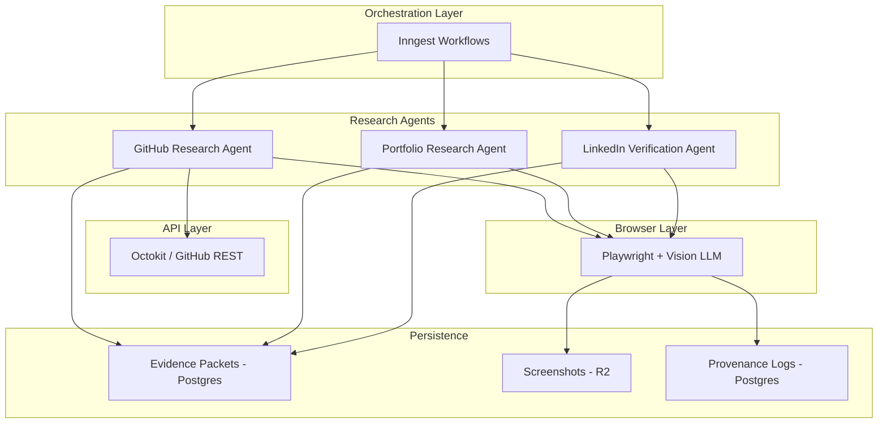
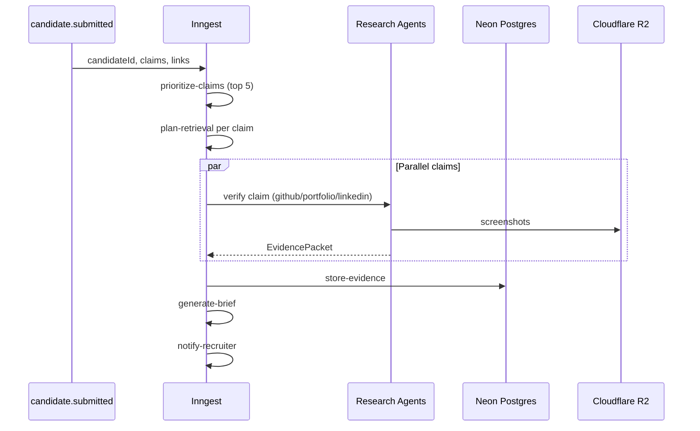

# DeepHire: Agentic Browser Automation Architecture

**Technical Specification v1.0**

This document is the implementation companion to [deephire_product_document_browser_agents.md](./deephire_product_document_browser_agents.md). It defines how DeepHire’s hybrid retrieval layer (API + vision-enabled browser agents) is built, orchestrated, stored, and governed.

---

## Table of Contents

1. [System Overview](#1-system-overview)
2. [Agent Architecture](#2-agent-architecture)
3. [GitHub Research Agent](#3-github-research-agent)
4. [Portfolio Research Agent](#4-portfolio-research-agent)
5. [LinkedIn Verification Agent](#5-linkedin-verification-agent)
6. [Evidence System](#6-evidence-system)
7. [Technical Implementation](#7-technical-implementation)
8. [Cost & Performance](#8-cost--performance)
9. [Governance & Safety](#9-governance--safety)
10. [Tech Stack](#10-tech-stack)

---

## 1. System Overview

### Core philosophy

DeepHire uses **hybrid intelligent retrieval**:

| Mode | When to use | Examples |
|------|-------------|----------|
| **Structured APIs** | Data is clean, queryable, and cheap | GitHub repo metadata, languages, commits, stars |
| **Autonomous browser agents** | Human judgment on public pages is required | README quality, portfolio design, live demos, deployment evidence |

This matches the product workflow: claim extraction → retrieval planning → hybrid execution → evidence judgment → candidate brief (see product doc §End-to-end workflow).

### Agent types

| Agent | Mode | Purpose | Est. cost / claim |
|-------|------|---------|-------------------|
| **GitHub Research Agent** | API + browser hybrid | Verify technical skills, assess shipped work, find deployment evidence | $0.15–0.30 |
| **Portfolio Research Agent** | Browser-first | Discover projects, assess product thinking, verify demos | $0.20–0.35 |
| **LinkedIn Verification Agent** | Minimal browser | Timeline consistency, title verification only | $0.10 |

Agents do **not** make hiring decisions. They produce evidence packets for human-reviewed briefs.

### Architecture diagram



ASCII equivalent:

```
┌─────────────────────────────────────────────────────────────┐
│                    Orchestration Layer                       │
│                    (Inngest Workflows)                       │
└──────────────────────┬──────────────────────────────────────┘
                       │
        ┌──────────────┼──────────────┐
        ▼              ▼              ▼
┌──────────────┐ ┌──────────────┐ ┌──────────────┐
│   GitHub     │ │  Portfolio   │ │  LinkedIn    │
│   Research   │ │  Research    │ │ Verification │
│   Agent      │ │  Agent       │ │  Agent       │
└──────┬───────┘ └──────┬───────┘ └──────┬───────┘
       │                │                │
       ├─ Octokit API   │                │
       └─ Playwright ───┴────────────────┴─ Vision LLM
                       │
        ┌──────────────┼──────────────┐
        ▼              ▼              ▼
┌──────────────┐ ┌──────────────┐ ┌──────────────┐
│  Evidence    │ │  Screenshots │ │  Provenance  │
│  Packets     │ │  (R2)        │ │  Logs        │
│  (Postgres)  │ │              │ │  (Postgres)  │
└──────────────┘ └──────────────┘ └──────────────┘
```

---

## 2. Agent Architecture

### Base agent interface

All research agents implement a shared contract:

```typescript
interface ResearchAgent {
  verifyClaimWithEvidence(
    claim: Claim,
    candidateLinks: CandidateLinks,
    retrievalBudget: RetrievalBudget
  ): Promise<EvidencePacket>

  decideNextAction(context: AgentContext): Promise<AgentAction>
  executeAction(action: AgentAction): Promise<ActionResult>
  extractEvidence(page: Page): Promise<Evidence[]>
  shouldStopRetrieval(context: AgentContext): boolean
}
```

### Retrieval budget

Every browser session is bounded:

```typescript
interface RetrievalBudget {
  maxSteps: number              // 10–20 navigation steps
  maxTimeSeconds: number        // 60–120s wall time
  maxVisionCalls: number        // 10–15 LLM vision calls
  minEvidenceThreshold: number  // Stop when confidence exceeds threshold
}
```

### Agent context

```typescript
interface AgentContext {
  claim: Claim
  currentUrl: string
  visitedUrls: string[]
  evidenceCollected: Evidence[]
  stepsTaken: number
  timeElapsed: number
  lastScreenshot: Buffer
  pageText: string
  budget: RetrievalBudget
}
```

### Agent actions

```typescript
interface AgentAction {
  type: 'navigate' | 'click' | 'scroll' | 'extract' | 'done'
  target?: string            // URL or CSS selector
  reasoning: string
  expectedOutcome: string
  extracted_evidence?: EvidenceSnippet[]  // when type === 'extract'
}
```

### Vision-enabled decision making

`VisionPlanner` drives the observe → plan → act loop. Each step sends:

- System prompt (claim, budget, allowed domains, action schema)
- Truncated page text (~2k chars)
- Current page screenshot (base64 PNG)

**Models**

| Task | Model | Rationale |
|------|-------|-----------|
| Action planning (navigate, click, extract) | GPT-4o or Claude 3.5 Sonnet | Needs vision + structured JSON |
| Shipped-work scoring, light extraction | GPT-4o-mini | Cheaper text-only judgment |
| Final claim verdict (post-retrieval) | Claude 3.5 Sonnet | Evidence judgment quality |

**Planner rules (enforced in prompt + code)**

- Only visit allowlisted domains
- Extract **exact** text snippets from the page
- Stop after 2–3 strong evidence items or clear dead end
- Return JSON: `action`, `target`, `reasoning`, optional `extracted_evidence`

```typescript
class VisionPlanner {
  async decideNextAction(
    context: AgentContext,
    allowedDomains: string[]
  ): Promise<AgentAction> {
    // System prompt includes:
    // - CLAIM TO VERIFY, CLAIM TYPE, CURRENT URL
    // - STEPS TAKEN / budget.maxSteps
    // - ALLOWED DOMAINS
    // - ACTIONS: navigate | click | scroll | extract | done
    //
    // User message: pageText slice + screenshot image_url
    // response_format: json_object
  }
}
```

### Stop conditions

`shouldStopRetrieval` returns true when any of:

- `stepsTaken >= budget.maxSteps`
- `timeElapsed >= budget.maxTimeSeconds`
- `visionCallCount >= budget.maxVisionCalls`
- Aggregated evidence confidence ≥ `budget.minEvidenceThreshold` with ≥ 2 items
- Planner returns `done`

---

## 3. GitHub Research Agent

**Strategy:** API-first for discovery; browser for quality and proof.

GitHub REST APIs excel at repo lists, languages, commits, and topics. They do not judge README depth, deployment folders, or whether a project is impressive—that is the browser phase.

### Claim type → retrieval strategy

| Claim type | API phase | Browser phase |
|------------|-----------|---------------|
| `skill` | `findReposWithSkill` — filter by language, topics, name, description | README, `src/`, dependency files |
| `project` | `findProjectRepos` — name/description match | Repo page, demos, deployment artifacts |
| `ownership` | `analyzeCommitPatterns` — author-filtered commits | Contribution graph, commit history UI |
| `deployment` | Topics, repo metadata | README links, `Dockerfile`, CI configs |
| `scale` | Stars, activity dates | README claims, architecture docs |

### Three-phase pipeline

```
PHASE 1: API Discovery (Octokit)     → cheap, fast
PHASE 2: Browser Inspection          → vision-guided navigation on github.com only
PHASE 3: Merge + verdict             → EvidencePacket
```

### Phase 1: API discovery

```typescript
class GitHubResearchAgent implements ResearchAgent {
  async verifyClaimWithEvidence(
    claim: Claim,
    candidateLinks: CandidateLinks,
    budget: RetrievalBudget
  ): Promise<EvidencePacket> {
    const username = extractUsername(candidateLinks.github)
    const apiEvidence = await this.apiPhase(username, claim)
    const browserEvidence = await this.browserPhase(username, claim, apiEvidence, budget)
    return this.createEvidencePacket(claim, apiEvidence, browserEvidence)
  }
}
```

**`findReposWithSkill` (example)**

1. `octokit.repos.listForUser` (sort: `updated`, per_page: 100)
2. Filter: `language`, `topics`, `name`, `description` vs `claim.skill`
3. Top 5 repos: `listLanguages`, `listCommits` (author = username)
4. Output: `APIEvidence` with `repos[]`, `summary`, `confidence` (e.g. 0.7 if matches found)

### Phase 2: Browser inspection

- Launch Chromium (headless; `--disable-blink-features=AutomationControlled`)
- Viewport 1280×720; realistic user agent
- Start: `https://github.com/{username}`
- Loop: screenshot → `pageText` → `VisionPlanner.decideNextAction` → execute
- **Allowed domains:** `github.com`, `raw.githubusercontent.com` only
- On `extract`: persist snippet + screenshot buffer → upload to R2

### Example: “Built scalable backend with FastAPI”

| Step | Action | Outcome |
|------|--------|---------|
| API | Filter repos | `microservices-platform` — Python, topic `fastapi`, 143 commits |
| 1 | Navigate profile | See pinned repos |
| 2 | Click repo | Land on repo page |
| 3 | Read README | FastAPI badge, architecture diagram |
| 4 | Open `src/` | `from fastapi import FastAPI` in `main.py` |
| 5 | Extract | README: “10k requests/second” |
| 6 | Open deployment folder | Dockerfile, docker-compose |
| 7 | `done` | Verdict: **SUPPORTED**, confidence ~0.9 |

---

## 4. Portfolio Research Agent

**Strategy:** Browser-first; no reliable portfolio API.

The agent navigates like a recruiter: project cards, case studies, “Live Demo” buttons, and hosted demos on Vercel/Netlify/etc.

### Domain policy

| Scope | Domains |
|-------|---------|
| Primary | Hostname of `candidateLinks.portfolio` |
| Demo hosts (follow links) | `vercel.app`, `netlify.app`, `herokuapp.com`, `github.io`, `web.app`, `firebaseapp.com` |

Navigation to other domains is **skipped** (not executed).

### Flow

1. `page.goto(portfolioUrl)`
2. Vision loop with `allowedDomains: [portfolioHost, ...demoHosts]`
3. On `extract`: full-page screenshot for evidence
4. Post-loop: `assessShippedWork(evidence, claim)` via GPT-4o-mini → `shippedWorkScore`
5. `createEvidencePacket` including optional `ShippedWorkItem[]`

### Example: “Built React applications”

| Step | Finding |
|------|---------|
| Homepage | Nav to Projects |
| /projects | Card: “E-commerce Dashboard — React, TypeScript” → extract |
| Project detail | React, Redux, Tailwind; Live Demo button |
| Demo URL | Working cart UI → extract |
| Done | **SUPPORTED**, `shippedWorkScore` ~0.85 |

### Shipped work assessment prompt (summary)

Rate 0.0–1.0 on: live demo, technical impressiveness, claim relevance, product thinking, recency (2 years). Return `{ score, reasoning }`.

---

## 5. LinkedIn Verification Agent

**Strategy:** Minimal, conservative, timeline-only.

LinkedIn is **high-risk** for hiring automation. Use only for employment/timeline claims—not skills, endorsements, photos, or feed activity.

### Allowed claim types

- `timeline`
- `employment`
- `education`

All other claim types → `noEvidencePacket("LinkedIn not used for this claim type")`.

### Implementation summary

1. Stealth browser (`headless: false` recommended—LinkedIn detects headless)
2. Single profile load → screenshot + `pageText`
3. `extractTimeline` (vision + text) → positions: title, company, dates
4. `checkConsistency(linkedinData, claim)` vs resume company/title
5. **All LinkedIn evidence requires human review**

### Governance constants

```typescript
const LINKEDIN_RULES = {
  allowedClaimTypes: ['timeline', 'employment', 'education'],
  forbiddenExtractions: [
    'profile_photo', 'skills_endorsements', 'recommendations',
    'connections_count', 'activity_feed', 'personal_interests'
  ],
  maxProfilesPerHour: 10,
  cooldownBetweenRequests: 60,  // seconds
  requiresHumanReview: true,
  logAllLinkedInAccess: true,
  retentionPolicy: '30 days'
}
```

---

## 6. Evidence System

### Evidence packet (normalized output)

Every agent returns:

```typescript
interface EvidencePacket {
  claimId: string
  claimText: string
  claimType: ClaimType

  verdict: 'SUPPORTED' | 'WEAKLY_SUPPORTED' | 'UNVERIFIED' | 'CONTRADICTED'
  confidence: number  // 0.0–1.0

  evidence: Evidence[]
  retrievalMetadata: {
    agentType: 'github' | 'portfolio' | 'linkedin'
    retrievalMode: 'api' | 'browser' | 'hybrid'
    totalSteps: number
    visitedUrls: string[]
    timeElapsedSeconds: number
    visionCallCount: number
    costUSD: number
  }
  provenance: ProvenanceLog[]
  shippedWork?: ShippedWorkItem[]
  createdAt: Date
}
```

### Evidence item

```typescript
interface Evidence {
  claimId: string
  sourceUrl: string
  sourceType: string           // e.g. github_browser, portfolio_browser
  snippets: EvidenceSnippet[]
  screenshot?: Buffer          // uploaded → R2 key in DB
  timestamp: Date
  agentReasoning: string
  pageTitle?: string
}

interface EvidenceSnippet {
  text: string                 // exact quote
  relevance: number            // 0.0–1.0
  supports_claim: boolean | 'uncertain'
  context?: string
}
```

### Provenance log

```typescript
interface ProvenanceLog {
  step: number
  action: string
  url: string
  timestamp: Date
  reasoning: string
  screenshotKey?: string       // R2 object key
}
```

### Shipped work item

```typescript
interface ShippedWorkItem {
  title: string
  description: string
  technologies: string[]
  sourceUrl: string
  demoUrl?: string
  hasLiveDemo: boolean
  githubUrl?: string
  relevanceToRole: number
  technicalDepth: number
  recency: Date
  evidenceScreenshots: string[]  // R2 keys
}
```

### Example packet (abbreviated)

```json
{
  "claimId": "c_123",
  "claimText": "Built real-time chat application with WebSockets",
  "claimType": "project",
  "verdict": "SUPPORTED",
  "confidence": 0.88,
  "retrievalMetadata": {
    "agentType": "github",
    "retrievalMode": "hybrid",
    "totalSteps": 12,
    "visionCallCount": 8,
    "costUSD": 0.24
  }
}
```

Screenshots are stored in R2; JSONB in Postgres holds metadata and snippet text only.

---

## 7. Technical Implementation

### Orchestration: Inngest

Main workflow: `verify-candidate` on event `candidate.submitted`.



**Steps**

1. **prioritize-claims** — sort by `jobRelevance`, take top 5
2. **plan-retrieval** — `determineAgents(claim, links)` + `calculateBudget(claim)`
3. **verify-{claimId}** — run agents in parallel per claim; `mergeEvidencePackets`
4. **store-evidence** — Drizzle → `evidence_packets`, screenshots, provenance
5. **generate-brief** — deterministic scores + LLM narrative
6. **notify-recruiter**

### Agent routing

```typescript
function determineAgents(claim: Claim, links: CandidateLinks): AgentType[] {
  const agents: AgentType[] = []

  if (['skill', 'project', 'ownership'].includes(claim.type) && links.github) {
    agents.push('github')
  }
  if (['project', 'deployment'].includes(claim.type) && links.portfolio) {
    agents.push('portfolio')
  }
  if (['timeline', 'employment'].includes(claim.type) && links.linkedin) {
    agents.push('linkedin')
  }
  return agents
}
```

### Budget calculation

```typescript
function calculateBudget(claim: Claim): RetrievalBudget {
  const baseSteps = 10
  const priorityMultiplier = claim.jobRelevance  // 0.0–1.0
  return {
    maxSteps: Math.floor(baseSteps * (1 + priorityMultiplier)),
    maxTimeSeconds: 120,
    maxVisionCalls: 15,
    minEvidenceThreshold: 0.7
  }
}
```

### Database schema (Postgres / Neon)

```sql
CREATE TABLE evidence_packets (
  id UUID PRIMARY KEY DEFAULT gen_random_uuid(),
  candidate_id UUID NOT NULL REFERENCES candidates(id),
  claim_id UUID NOT NULL REFERENCES claims(id),
  claim_text TEXT NOT NULL,
  claim_type TEXT NOT NULL,
  verdict TEXT NOT NULL CHECK (verdict IN (
    'SUPPORTED', 'WEAKLY_SUPPORTED', 'UNVERIFIED', 'CONTRADICTED'
  )),
  confidence DECIMAL(3,2) NOT NULL,
  agent_type TEXT NOT NULL,
  retrieval_mode TEXT NOT NULL,
  total_steps INTEGER,
  visited_urls TEXT[],
  time_elapsed_seconds INTEGER,
  vision_call_count INTEGER,
  cost_usd DECIMAL(10,4),
  evidence JSONB NOT NULL,
  provenance JSONB NOT NULL,
  shipped_work JSONB,
  created_at TIMESTAMP DEFAULT NOW()
);

CREATE TABLE evidence_screenshots (
  id UUID PRIMARY KEY DEFAULT gen_random_uuid(),
  evidence_packet_id UUID REFERENCES evidence_packets(id),
  s3_key TEXT NOT NULL,
  url TEXT NOT NULL,
  step_number INTEGER,
  created_at TIMESTAMP DEFAULT NOW()
);

CREATE TABLE provenance_logs (
  id UUID PRIMARY KEY DEFAULT gen_random_uuid(),
  evidence_packet_id UUID REFERENCES evidence_packets(id),
  step INTEGER NOT NULL,
  action TEXT NOT NULL,
  url TEXT NOT NULL,
  reasoning TEXT,
  screenshot_s3_key TEXT,
  created_at TIMESTAMP DEFAULT NOW()
);

CREATE TABLE shipped_work_items (
  id UUID PRIMARY KEY DEFAULT gen_random_uuid(),
  candidate_id UUID REFERENCES candidates(id),
  evidence_packet_id UUID REFERENCES evidence_packets(id),
  title TEXT NOT NULL,
  description TEXT,
  technologies TEXT[],
  source_url TEXT,
  demo_url TEXT,
  github_url TEXT,
  has_live_demo BOOLEAN DEFAULT false,
  relevance_to_role DECIMAL(3,2),
  technical_depth DECIMAL(3,2),
  recency DATE,
  created_at TIMESTAMP DEFAULT NOW()
);

CREATE INDEX idx_evidence_candidate ON evidence_packets(candidate_id);
CREATE INDEX idx_evidence_claim ON evidence_packets(claim_id);
CREATE INDEX idx_shipped_work_candidate ON shipped_work_items(candidate_id);
```

ORM: **Drizzle**. Cache vision decisions: **Upstash Redis** (`vision:{pageHash}`).

### Browser runtime

- **Engine:** Playwright (Chromium)
- **Stealth:** `playwright-stealth` where needed (especially LinkedIn)
- **Screenshots:** upload to Cloudflare R2 (S3-compatible API)
- **Sessions:** prefer one browser per candidate, multiple claims sequential inside session (batch optimization)

### Product ↔ implementation mapping

| Product doc concept | Implementation |
|--------------------|----------------|
| Hybrid retrieval layer | GitHub API phase + browser phase; portfolio browser-only |
| Browser research layer | `ResearchAgent` + `VisionPlanner` + budgets |
| Evidence packets | `EvidencePacket` + R2 screenshots + provenance |
| Timeline/Consistency Agent | `LinkedInVerificationAgent` (restricted scope) |
| Analysis status screen | Inngest step progress + per-claim agent metadata |

---

## 8. Cost & Performance

### Cost breakdown (per candidate)

**Assumptions:** 5 claims; mix of GitHub hybrid, portfolio browser, occasional LinkedIn.

| Component | Unit cost | Per claim | Per candidate (5 claims) |
|-----------|-----------|-----------|--------------------------|
| GPT-4o vision | ~$0.01/image | 8 × $0.01 = $0.08 | ~$0.40 |
| GPT-4o-mini text | ~$0.15/1M in | ~5k tokens | ~$0.004 |
| Playwright compute | ~$0.0001/s | 60s | ~$0.03 |
| R2 storage | ~$0.023/GB | ~2 MB | ~$0.00025 |
| GitHub API | Free | $0 | $0 |
| **Total** | | **~$0.15/claim** | **~$0.75/candidate** |

### Optimization strategies

1. **Early stop** — confidence > 0.85 and ≥ 2 evidence items → `done`
2. **API-first** — skip browser if `apiEvidence.confidence > 0.7` and claim is skill-only metadata
3. **Redis cache** — cache planner decisions by page content hash
4. **Batch browser sessions** — one browser, multiple claims per candidate
5. **Model routing** — scroll/simple UI decisions → `gpt-4o-mini`; navigation/extract → `gpt-4o`

### Performance targets

| Metric | Target | Notes |
|--------|--------|-------|
| Time per candidate | < 3 min | Parallel claim verification (Inngest concurrency: 5) |
| Vision LLM latency | < 2 s | Per planning call |
| Browser time per claim | < 60 s | Most evidence in first ~10 steps |
| Throughput | ~20 candidates/hour | 5 parallel workers |
| Cost per 100 candidates | < $75 | At ~$0.75/candidate |

---

## 9. Governance & Safety

### Allowlisted domains

```typescript
const ALLOWED_DOMAINS = {
  github: ['github.com', 'raw.githubusercontent.com'],
  portfolio_hosting: [
    'vercel.app', 'netlify.app', 'herokuapp.com',
    'github.io', 'web.app', 'firebaseapp.com'
  ],
  linkedin: ['linkedin.com'],
  custom: []  // per-candidate, validated before run
}
```

`isDomainAllowed(url)` must pass before every `navigate` and off-origin `click` follow.

### Safety rules

| Rule | Enforcement |
|------|-------------|
| Allowlist only | `enforceAllowlist: true` on all browser agents |
| No PII beyond job relevance | Block SSN, DOB, home address, phone, photo, protected attributes |
| Human review | LinkedIn evidence; contradicted claims; confidence < 0.5 |
| Rate limits | 50 browser sessions/hour; 20 LinkedIn profiles/day |
| Audit | Log all sessions; retain 90 days |
| No auto-reject | `cannotAutoReject: true` — agents recommend only |
| Provenance | Every evidence item has `sourceUrl`; screenshots tied to URL |

### Audit log shape

```typescript
interface AuditLog {
  sessionId: string
  candidateId: string
  agentType: 'github' | 'portfolio' | 'linkedin'
  startTime: Date
  endTime: Date
  visitedUrls: string[]
  screenshotsTaken: number
  dataExtracted: { type: string; field: string; value: string; sourceUrl: string }[]
  initiatedBy: { recruiterId?: string; automatedWorkflow: boolean }
  actions: { step: number; action: string; timestamp: Date; llmDecision: string }[]
  costUSD: number
  visionCallCount: number
  verdict: string
  confidence: number
}
```

### Alignment with product governance (product doc §Governance)

- Public, job-relevant data only
- LinkedIn higher risk than GitHub/portfolio
- Human review for reject recommendations and high-risk flags
- Provenance on every packet for recruiter evidence viewer

---

## 10. Tech Stack

| Layer | Choice |
|-------|--------|
| **Frontend** | Next.js 14 (App Router), Tailwind CSS, shadcn/ui, Vercel |
| **Backend API** | Next.js API Routes (or FastAPI if split later) |
| **Database** | Neon Postgres (serverless) |
| **ORM** | Drizzle ORM |
| **Cache** | Upstash Redis |
| **Orchestration** | Inngest (serverless workflows) |
| **Agents** | Custom: Playwright + vision LLM planner |
| **Browser** | Playwright + playwright-stealth |
| **Object storage** | Cloudflare R2 (resumes, screenshots; S3-compatible) |
| **LLMs** | GPT-4o (vision/planning), Claude 3.5 Sonnet (judgment), GPT-4o-mini (cheap extraction/scoring) |
| **GitHub** | Octokit (REST API v3) |
| **ATS (later)** | Greenhouse REST + webhooks |
| **Monitoring** | Sentry; Inngest dashboard; custom LLM cost logging |

### Repository layout (recommended)

```
/apps
  /web          # Next.js recruiter dashboard
/packages
  /agents       # ResearchAgent, VisionPlanner, GitHub/Portfolio/LinkedIn agents
  /db           # Drizzle schema + migrations
  /workflows    # Inngest functions (verify-candidate, etc.)
```

### Environment variables

| Variable | Purpose |
|----------|---------|
| `GITHUB_TOKEN` | Octokit authenticated requests |
| `DATABASE_URL` | Neon Postgres |
| `UPSTASH_REDIS_REST_URL` | Vision decision cache |
| `R2_*` | Screenshot and resume storage |
| `OPENAI_API_KEY` | GPT-4o / mini |
| `ANTHROPIC_API_KEY` | Claude judgment |
| `INNGEST_EVENT_KEY` | Workflow triggers |
| `SENTRY_DSN` | Error tracking |

---

## Appendix A: Claim and link types

```typescript
type ClaimType =
  | 'skill' | 'project' | 'scale' | 'ownership'
  | 'deployment' | 'leadership' | 'outcome'
  | 'timeline' | 'employment' | 'education'

interface Claim {
  id: string
  text: string
  type: ClaimType
  skill?: string
  company?: string
  title?: string
  jobRelevance: number  // 0.0–1.0
}

interface CandidateLinks {
  github?: string
  portfolio?: string
  linkedin?: string
  projectUrls?: string[]
}
```

## Appendix B: Verdict rubric

| Verdict | Typical conditions |
|---------|-------------------|
| **SUPPORTED** | Multiple high-relevance snippets; supports_claim true; confidence ≥ 0.75 |
| **WEAKLY_SUPPORTED** | Indirect or single weak snippet; confidence 0.4–0.74 |
| **UNVERIFIED** | No public evidence or budget exhausted |
| **CONTRADICTED** | Explicit contradicting snippet; triggers human review |

---

## Document history

| Version | Date | Notes |
|---------|------|-------|
| 1.0 | 2026-05-24 | Initial technical spec aligned with product doc and hybrid agent architecture |
